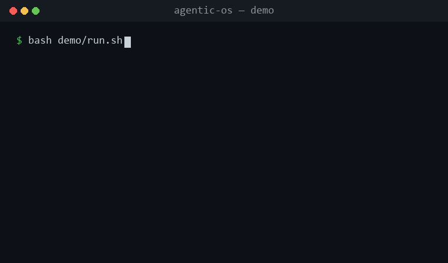

<h1 align="center">Agentic OS</h1>

<p align="center">
  <strong>"Done." — your AI coding agent, about code it didn't test.</strong><br/>
  Agentic OS turns "done" into a receipt you can check: leaked secrets, missing tests, and skipped
  steps get caught by git hooks, validators, and CI — not by trusting the agent to self-report.
</p>

<p align="center">
  <sub>A governance-first layer for AI coding agents — Claude Code, Codex, Cursor, Copilot, Antigravity.</sub>
</p>

<p align="center">
  <a href="https://github.com/KbWen/agentic-os/releases"></a>
  <a href="https://github.com/KbWen/agentic-os/actions/workflows/validate.yml"></a>
  <a href="https://github.com/KbWen/agentic-os/actions/workflows/security.yml"></a>
  <a href="https://opensource.org/licenses/MIT"></a>
  &nbsp;·&nbsp;
  <a href="docs/README_zh-TW.md">繁體中文</a> ·
  <a href="CONTRIBUTING.md">Contributing</a> ·
  <a href="CHANGELOG.md">Changelog</a>
</p>

<p align="center">
  
</p>

<p align="center"><sub>Real output from the credential gate — not a mockup. Run it yourself, no install, ~2 seconds:</sub></p>

```sh
bash demo/run.sh          # Windows (PowerShell): pwsh demo/run.ps1
```

<details>
<summary>Full terminal output</summary>

```text
  An AI agent wrote this file and reported: "Done — config added."
  ----------------------------------------------------------------
    DB_HOST=prod.internal
    aws_access_key_id = AKIA****************
  ----------------------------------------------------------------

  Without a gate, that commit lands and the key is in git history forever.
  Agentic OS runs this before the commit is allowed:

    $ scan_credentials.py config.env

CREDENTIAL PATTERN(S) DETECTED (values redacted):
  config.env:2: aws-access-key-id
Rotate the exposed secret, remove it from the change, then retry.

  Commit BLOCKED. The agent said "done"; the machine said no — and it
  redacted the value instead of echoing your secret back at you.
```

</details>

The key is generated at runtime and redacted on output, so the demo never stores or prints a real secret. It's one check of several.

## Not just another rules file

A rules file (Cursor Rules, a plain `AGENTS.md`) tells the agent how to behave — and the agent can ignore it. Agentic OS keeps most of that *discipline* (plan first, don't refactor what nobody asked for, declare confidence) but puts the failures that actually burn you behind checks the agent **can't** talk past:

| The failure that burns you | What catches it | When |
|:---|:---|:---|
| A secret committed to history | `scan_credentials.py` (the demo above) | pre-commit hook + CI |
| "Tests pass" with no tests | CI runs the real suite | pull request |
| A phase skipped with no evidence | `validate.sh` reads the work trail | pre-commit (local) |

A passing run is a receipt you can check, not a promise you take on faith.

## What you get

- **Gate-enforced phases** — every task runs bootstrap → plan → implement → review → test → ship; a skipped phase surfaces as a failed check, not a silent gap.
- **Machine-enforced backstops** — leaked secrets, "tests pass" with no tests, OWASP-class issues: caught by hooks and CI, outside the agent's control so it can't grade its own homework.
- **Skills that auto-attach** by task type — TDD, security review, systematic debugging, and more, with no manual wiring.
- **Memory across sessions** — one source-of-truth state file, so decisions and evidence survive handoffs between conversations and agents.
- **Cross-platform** — Claude Code, Codex, Cursor, Copilot, Antigravity, or any Markdown-reading agent.

Workflow, classification tiers, the full skill and command list, and architecture → **[docs/reference.md](docs/reference.md)**.

## Quick start

```bash
git clone https://github.com/KbWen/agentic-os.git
./agentic-os/installers/deploy_brain.sh --dry-run /path/to/your-project   # preview, no changes
./agentic-os/installers/deploy_brain.sh /path/to/your-project             # deploy
```

Then tell your agent: *"Read `AGENTS.md` and follow it. Do not claim completion until /review and /test pass."* — followed by `/bootstrap` and your task.

Existing files are never overwritten (saved as `.acx-incoming` sidecars to merge). Windows / no-Python mode, updating, customizing without conflicts, and the new-project vs. existing-repo entry points → **[docs/INSTALL.md](docs/INSTALL.md)**.

## FAQ

**What is Agentic OS?**
An open-source governance framework for AI coding agents. It gives agents like Claude Code, Codex, Cursor, Copilot, and Antigravity a repeatable workflow — plan, build, review, test, ship — and enforces gates so they can't skip steps or call a task "done" without verifiable evidence.

**How is it different from Cursor Rules or a plain `AGENTS.md` file?**
A rules file tells the agent how to behave. Agentic OS adds the workflow and the gates that hold it to that behavior: phase sequencing, evidence requirements, scope discipline, and a single source of truth that remembers decisions across sessions. It's the difference between a prompt the agent might follow and a workflow it has to.

**Which agents does it support?**
Any agent that can read Markdown. It ships native entry points for Claude Code (`CLAUDE.md`) and Codex / Antigravity (`AGENTS.md`), and works with Cursor, GitHub Copilot, and other LLM agents through the same model-agnostic workflow files.

**Is it free?**
Yes — MIT licensed. Use it, fork it, ship it.

## Docs

| Goal | Start here |
|:---|:---|
| Install, update, customize | [Install & Usage](docs/INSTALL.md) |
| Look up workflows, skills, commands, architecture | [Reference](docs/reference.md) |
| Choose a model · see real token costs | [Model Guide](docs/AGENT_MODEL_GUIDE.md) · [Lifecycle Benchmark](docs/LIFECYCLE_BENCHMARK.md) |
| Understand the rules & evidence standard | [Agent Philosophy](.agentcortex/docs/AGENT_PHILOSOPHY.md) · [Testing Protocol](.agentcortex/docs/TESTING_PROTOCOL.md) |
| Platform-specific notes | [Codex](.agentcortex/docs/CODEX_PLATFORM_GUIDE.md) · [Claude](.agentcortex/docs/CLAUDE_PLATFORM_GUIDE.md) |

## Contributing

See [CONTRIBUTING.md](CONTRIBUTING.md) — guidelines for contributing as a human or an AI agent.

## License

MIT. See [LICENSE](LICENSE).

<p align="center"><sub>A governance-first layer for AI coding agents. Contributions and feedback welcome.</sub></p>
