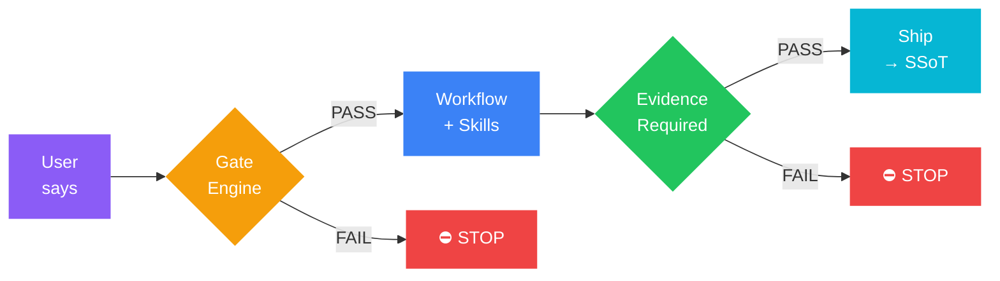

<p align="center">
  
</p>

<h1 align="center">Agentic OS</h1>

<p align="center">
  <strong>A governance-first layer for AI coding agents.</strong><br/>
  Portable workflows, delivery gates, engineering guardrails, and 14 professional skills<br/>
  for Claude Code, OpenAI Codex, Google Antigravity, Cursor, GitHub Copilot, and other coding agents.
</p>

<p align="center">
  <a href="https://github.com/KbWen/agentic-os/actions/workflows/validate.yml"></a>
  <a href="https://github.com/KbWen/agentic-os/actions/workflows/security.yml"></a>
  <a href="https://opensource.org/licenses/MIT"></a>
</p>

<p align="center">
  <a href="docs/README_zh-TW.md">繁體中文</a> &middot;
  <a href="https://github.com/KbWen/agentic-os/blob/main/CONTRIBUTING.md">Contributing</a> &middot;
  <a href="https://github.com/KbWen/agentic-os/blob/main/CHANGELOG.md">Changelog</a>
</p>

---

## The Problem

AI coding agents are powerful, but they need shared operating rules. Without structure, they can:

- **Skip steps** — jump straight to code without planning or reviewing
- **Hallucinate completion** — claim "done" without verifiable evidence
- **Drift from scope** — refactor code nobody asked them to touch
- **Lose context** — forget decisions across conversations, forcing re-derivation
- **Break things silently** — no safety gates between "idea" and "production"

## The Solution

**Agentic OS** is a portable governance framework that gives AI agents a repeatable engineering workflow. Install it into your project, and your AI agents gain:



The idea behind every phase is the same: if there's no verifiable evidence, the task isn't done — and the gates enforce that, instead of trusting the agent to self-report honestly.

---

## Features

### Gate Engine & Phase System

Every task flows through mandatory phases. The AI cannot skip ahead.


| Classification | Required Phases |
|:---|:---|
| **tiny-fix** | Classify → Execute → Evidence → Done |
| **quick-win** | Bootstrap → Plan → Implement → Evidence → Ship |
| **feature** | Bootstrap → Spec → Plan → Implement → Review → Test → Handoff → Ship |
| **hotfix** | Bootstrap → Research → Plan → Implement → Review → Test → Ship |
| **architecture-change** | Bootstrap → ADR → Spec → Plan → Implement → Review → Test → Handoff → Ship |

### Engineering Guardrails

A constitution for AI behavior — loaded automatically, enforced at every phase:

- **No Evidence = No Completion** — narrative claims are not proof
- **Scope Discipline** — unauthorized refactoring is strictly prohibited
- **Destructive Command Blocking** — `rm -rf`, `git reset --hard`, force pushes require pre-approved rollback plans
- **OWASP Top 10 Auto-Scan** — security checks run during `/implement` and `/review`
- **Confidence Gate** — AI must declare confidence level; low confidence triggers escalation

### 14 Professional Skills

Skills auto-activate based on task classification and workflow phase:

| Skill | Trigger | Description |
|:---|:---|:---|
| Test-Driven Development | feature, architecture-change | Red → Green → Refactor cycles |
| Systematic Debugging | bug encounter | 4-phase root cause analysis |
| Red Team / Adversarial | review, test | Classification-based security analysis |
| API Design | API endpoints detected | Endpoint validation enforcement |
| Auth Security | auth code detected | Hashing, tokens, rate limiting |
| Database Design | migration detected | Forward-only ORM-aware migration safety |
| Frontend Patterns | UI components | Component and state management patterns |
| Parallel Agent Dispatching | complex tasks | Coordinated subagent execution |
| Subagent-Driven Development | multi-module tasks | Multi-agent coordination |
| Karpathy Principles | all coding tasks | Behavioral guardrails against common LLM coding mistakes |
| Production Readiness | feature, architecture-change | Pre-ship observability: error sinks, log strategy, rollback telemetry |
| Verification Before Completion | /ship | 5-gate check: Scope → Quality → Evidence → Risk → Communication |
| Git Worktrees | parallel branches | Worktree isolation workflows |
| Doc Lookup | documentation needed | Documentation retrieval strategy |

### Single Source of Truth (SSoT)

Every project has one canonical state file. AI agents read it first, write to it last.

```
.agentcortex/context/
├── current_state.md          # Global project state (SSoT)
└── work/
    └── <branch-name>.md      # Per-task work log (isolated)
```

- **Work Logs** track per-task progress, evidence, and gate receipts
- **SSoT** tracks global decisions, lessons, and ship history
- **Handoff** enables seamless AI-to-AI continuity across conversations

### Multi-Agent Collaboration

Built for teams where multiple AI sessions work on the same codebase:

- **One Branch = One Owner** — prevents concurrent Work Log corruption
- **Single-Writer Locking** — atomic lock files block concurrent sessions per branch (configurable back to advisory)
- **Ship Guard** — checks for SSoT conflicts before merging
- **Session Identity** — every AI session writes its model name and timestamp

### Three Entry Paths

Pick the one that matches your starting point (full opener templates in **Quick Start §2**):

| Starting point | First command | Full chain |
|---|---|---|
| 🆕 Brand-new project, multi-feature idea | `/spec-intake` | spec-intake → pick feature → bootstrap → app-init → plan → implement |
| 🏗️ Existing repo, adopting Agentic OS | `/audit` (read-only, zero risk) | audit → app-init → spec-intake → quick-win → feature |
| 🎯 Single concrete task on an established project | `/bootstrap` | bootstrap → plan → implement → review → test → ship |

See the [Lifecycle Benchmark](https://github.com/KbWen/agentic-os/blob/main/docs/LIFECYCLE_BENCHMARK.md) ([繁體中文](https://github.com/KbWen/agentic-os/blob/main/docs/LIFECYCLE_BENCHMARK_zh-TW.md)) for real token consumption data across 6 development scenarios.

### Token Efficiency

Designed for cost-effective models (Gemini Flash, Haiku, etc.):

- **Conditional Loading** — tiny-fix skips guardrails (~5,000 tokens saved)
- **Skill Cache Policy** — metadata-first loading, full SKILL.md only on cache miss
- **Phase Summary** — compact 1-liner per phase for low-token resume
- **Read-Once Discipline** — governance docs persist in context, never re-read

---

## Quick Start

### 1. Install

**Prerequisites**:

| Dependency | Required? | Purpose |
|:---|:---|:---|
| **Git** | Required | Clone and deploy the framework |
| **Bash** | Required | Run deploy & validate scripts (Git Bash from [Git for Windows](https://gitforwindows.org/) is enough on Windows) |
| **Python 3.9+** | Recommended | Enables full validation (metadata, encoding, command sync checks) |
| **SHA-256 tool** | Required for deploy | `sha256sum`, `shasum`, or `openssl` (pre-installed on most systems) |

> **No Python?** The framework deploys and works without Python. Validation runs in
> degraded mode — Python-dependent checks report `WARN` instead of `FAIL`.
> Pass `--no-python` to suppress warnings: `bash .agentcortex/bin/validate.sh --no-python`

**Install (first time):**

```bash
# Clone Agentic OS
git clone https://github.com/KbWen/agentic-os.git

# Preview what will be deployed (no changes made)
./agentic-os/installers/deploy_brain.sh --dry-run /path/to/your-project

# Deploy into your project
./agentic-os/installers/deploy_brain.sh /path/to/your-project
```

**Update (after first install):** the installer lives inside your project. Run it from your project root — it reads the deploy manifest and auto-fetches the latest framework version from GitHub.

```bash
bash installers/deploy_brain.sh .
```

> **Existing files won't be overwritten.** If your project already has `AGENTS.md`, `CLAUDE.md`, or other framework-managed files, they are preserved. The new framework version is saved as `<filename>.acx-incoming` sidecar. Review and merge manually — or ask your AI agent: *"Merge each .acx-incoming into its target, preserving my project-specific content and adopting framework updates."*

> **AI-agent install:** If you're asking an AI assistant to install Agentic OS, point it to this README. The commands above are deterministic — no platform-specific heuristics required.

**Optional local pre-commit validation:** enable the bundled Git hook sample to run Agentic OS validation before each commit.

```bash
cp .githooks/pre-commit.guard-ssot.sample .githooks/pre-commit
chmod +x .githooks/pre-commit
git config core.hooksPath .githooks
```

On Windows, run the setup from PowerShell:

```powershell
Copy-Item .githooks\pre-commit.guard-ssot.sample .githooks\pre-commit
git config core.hooksPath .githooks
```

The hook runs `validate.ps1` from Git Bash on Windows when PowerShell is available, otherwise it runs `validate.sh`. Validator failures block the commit; guarded SSoT receipt warnings remain advisory.

<details>
<summary><b>Windows (PowerShell / CMD)</b></summary>

```powershell
# Clone Agentic OS (first time)
git clone https://github.com/KbWen/agentic-os.git

# Preview what will be deployed (no changes made)
powershell -ExecutionPolicy Bypass -File .\agentic-os\installers\deploy_brain.ps1 -DryRun C:\path\to\your-project

# Deploy into your project
powershell -ExecutionPolicy Bypass -File .\agentic-os\installers\deploy_brain.ps1 C:\path\to\your-project

# CMD alternative
.\agentic-os\installers\deploy_brain.cmd C:\path\to\your-project
```

Use the PowerShell entrypoint when possible. It resolves Git Bash directly and does not require a WSL distro.
Git Bash is still required on Windows for shell-based deploy and validation scripts; the PowerShell entrypoint simply locates and invokes it for you.

```powershell
# Already installed? Run from your project root to update:
powershell -ExecutionPolicy Bypass -File .\installers\deploy_brain.ps1 .

# Validation after install
powershell -ExecutionPolicy Bypass -File .\.agentcortex\bin\validate.ps1

# Lightweight validation when Python is not installed
powershell -ExecutionPolicy Bypass -File .\.agentcortex\bin\validate.ps1 -NoPython

# (Git Bash equivalent)
bash ./.agentcortex/bin/validate.sh --no-python
```

</details>

<details>
<summary><b>Text-only usage (no scripts)</b></summary>

If you only want the governance templates (Markdown files) without running any tooling:

1. Copy the `.agent/`, `.agents/`, and `AGENTS.md` files into your project
2. Optionally copy `.agentcortex/context/` and `.agentcortex/templates/` for state management
3. No Python, Bash, or other tools are needed — all governance is plain Markdown

</details>

### 1a. Customizing Without Conflicts (Fork or Clone)

However you adopt Agentic OS — **fork** the repo, or **clone + `deploy_brain.sh`** into your project — the same rule keeps upgrades painless: **add your own files; never edit framework-owned files in place.** Put your customizations where the framework guarantees never to touch them, and they survive both `git pull upstream` (fork) and the next `deploy` (clone):

| You want to… | Put it here | Why it survives upgrades |
|---|---|---|
| Add project governance (narrow/disable a directive) | `AGENTS.override.md` (project root) or `~/.agentcortex/AGENTS.override.md` (personal) | Loaded present-only at session start; framework never ships these files. MAY narrow/disable directives but **cannot** relax delivery gates. |
| Add your own skills | `.agents/skills/custom-<name>/SKILL.md` (+ `.agent/skills/custom-<name>` metadata) | `custom-*` is a reserved namespace the framework never ships → zero collision, never overwritten. |
| Adjust skill activation (pin/exclude) | `.agentcortex/context/private/user-preferences.yaml` | Gitignored, personal, loaded by bootstrap. |

**What NOT to do:** editing a framework file in place (`AGENTS.md`, `.agent/rules/*`, `.agent/workflows/*`, a shipped skill body) causes merge conflicts on `git pull upstream` (fork) and is force-updated on the next `deploy` (clone). Framework **skills** are the one tolerant exception — if you edit one, `deploy` preserves your copy as a visible `<file>.acx-incoming` sidecar rather than silently overwriting it — but the cleaner pattern is always to copy it to a `custom-<name>` skill and edit that. Governance, security, and workflow files always force-update so you keep receiving fixes.

### 2. Start Working — Pick Your Entry Point

The right first command depends on your starting point. **Always preface with**:

> "Read `AGENTS.md` and follow it. Do not claim completion until /review and /test pass."

Then add **one** of the following based on your situation:

**A. Brand-new project, multi-feature idea** — `/spec-intake` first

```text
This is a brand-new project. My initial idea is:
[1–2 paragraphs describing the product and its features]

Please run /spec-intake to decompose this into a feature inventory.
After I pick the first feature, run /bootstrap → /app-init to establish
the tech stack ADR, then /plan and /implement.
```

**B. Existing repository adopting Agentic OS** — `/audit` first

```text
This repo already has code; Agentic OS was just deployed.
Run /audit (read-only) to map the codebase, then /app-init to record
the tech stack ADR, then /spec-intake when I add features.
```

**C. Single concrete task on an established project** — `/bootstrap` directly

```text
/bootstrap
[describe the single task]
```

> **Why this matters**: a multi-feature raw idea routed straight to `/bootstrap`
> is classified as a single task, skipping the Feature Inventory and
> `_product-backlog.md` decomposition. The Intent Router auto-detects this in
> most cases, but explicit beats inferred.

### 3. Follow the Flow

The AI will classify your task and follow the required phases automatically:

```
You: "Add pagination to the user list API"

AI: [/bootstrap] → Classification: feature
    → Required: Bootstrap → Spec → Plan → Implement → Review → Test → Handoff → Ship
    → Loading skills: API Design, Test-Driven Development
    → ⚡ ACX
```

---

## Commands

| Command | Purpose |
|:---|:---|
| `/bootstrap` | Initialize task, classify scope, create work log |
| `/spec-intake` | Import and decompose external specs |
| `/spec` | Define verifiable specifications |
| `/plan` | Create implementation plan with rollback steps |
| `/implement` | Execute code changes (gate-protected) |
| `/review` | Logic, security, and scope audit |
| `/test` | Verify with minimal necessary tests |
| `/handoff` | Resumable state summary for next session |
| `/ship` | Consolidate evidence, update SSoT, merge |
| `/adr` | Architecture Decision Record |
| `/brainstorm` | Rapid solution exploration |
| `/research` | Autonomous research and recommendation |
| `/audit` | Read-only system mapping |
| `/retro` | Retrospective analysis |
| `/decide` | Record key decisions with reasoning |
| `/hotfix` | Emergency fix escalation |

---

## Architecture

```
your-project/
├── AGENTS.md                    # Global AI governance directives
├── CLAUDE.md                    # Claude Code integration entry
│
├── .agent/                      # Agent Intelligence Layer
│   ├── config.yaml              # Governance constants
│   ├── rules/                   # Engineering & security guardrails
│   ├── skills/                  # Skill metadata (auto-trigger defs)
│   └── workflows/               # Workflow definitions (33 workflows)
│
├── .agents/skills/              # Full skill implementations (14 skills)
│   ├── test-driven-development/
│   ├── systematic-debugging/
│   └── ...
│
├── .agentcortex/                # Runtime & State Layer
│   ├── bin/                     # Deploy & validation scripts
│   ├── context/                 # SSoT + work logs
│   ├── docs/                    # Philosophy, platform guides, examples
│   ├── metadata/                # Skill registry & cache index
│   ├── templates/               # Reusable ADR/spec/README templates
│   └── tools/                   # Runtime tools (Python)
│
├── docs/                        # Project-level documentation
│   ├── specs/                   # Feature specifications
│   ├── adr/                     # Architecture Decision Records
│   └── architecture/            # Domain architecture docs
│
└── installers/                  # Cross-platform deploy wrappers
    ├── deploy_brain.sh          # Bash installer
    ├── deploy_brain.ps1         # PowerShell installer
    └── deploy_brain.cmd         # CMD installer
```

---

## Platform Compatibility

| Platform | Status | Integration |
|:---|:---|:---|
| **Claude Code** | Native support | `CLAUDE.md` entrypoint + Claude platform guide |
| **OpenAI Codex** | Native support | `AGENTS.md`, Codex platform guide, and CLI delegation workflow |
| **Google Antigravity** | Native support | Intent router + Antigravity runtime guidance |
| **Cursor** | Compatible | Uses `AGENTS.md` / project-rule style guidance |
| **GitHub Copilot** | Compatible | Uses repository instructions and guardrail docs |
| **Any LLM Agent** | Compatible | Model-agnostic Markdown workflows and evidence rules |

---

## Philosophy

Agentic OS is built on [10 non-negotiable principles](.agentcortex/docs/AGENT_PHILOSOPHY.md):

| # | Principle | Meaning |
|:---|:---|:---|
| 1 | AI Drives, Human Assists | AI follows phases autonomously; human confirms direction |
| 2 | Never Skip Phases | Sequential execution, not skip-to-end |
| 3 | Constitution Over Task | Guardrails override any request |
| 4 | No Evidence = No Completion | Claims without proof are rejected |
| 5 | Correctness First | Correct > performant > clever |
| 6 | Token Efficiency | Minimize cold-start cost, maximize context reuse |
| 7 | Cross-Model Compliance | Works with any AI model, no vendor lock-in |
| 8 | Actionable Documentation | Every doc must be directly usable |
| 9 | Scope Discipline | Only touch what was asked |
| 10 | Explainability | Every AI decision must be traceable |

---

## Documentation

Start with the document that matches what you are trying to do:

| Goal | Start Here | Why |
|:---|:---|:---|
| Install or upgrade Agentic OS | [Quick Start](#quick-start), [Migration Guide](.agentcortex/docs/guides/migration.md) | Deployment commands, update flow, and existing-project guidance |
| Choose the right AI model | [Model Selection Guide](docs/AGENT_MODEL_GUIDE.md), [Lifecycle Benchmark](docs/LIFECYCLE_BENCHMARK.md) | Practical model tradeoffs and measured token costs |
| Run disciplined agent workflows | [Agent Philosophy](.agentcortex/docs/AGENT_PHILOSOPHY.md), [Testing Protocol](.agentcortex/docs/TESTING_PROTOCOL.md) | Core rules, evidence expectations, and verification standards |
| Use a specific platform | [Codex Platform Guide](.agentcortex/docs/CODEX_PLATFORM_GUIDE.md), [Claude Platform Guide](.agentcortex/docs/CLAUDE_PLATFORM_GUIDE.md) | Platform-specific loading, handoff, and compatibility notes |
| Understand governance internals | [Document Governance](.agentcortex/docs/guides/doc-governance.md), [Nonlinear Scenarios](.agentcortex/docs/NONLINEAR_SCENARIOS.md) | State, handoff, recovery, and documentation lifecycle rules |
| Extend skills safely | [Skill Ecosystem](docs/architecture/skill-ecosystem.md), [Token Governance](.agentcortex/docs/guides/token-governance.md) | Skill packaging, trigger policy, and context budget control |

| Document | Description |
|:---|:---|
| [Agent Philosophy](.agentcortex/docs/AGENT_PHILOSOPHY.md) | 10 core principles |
| [Model Selection Guide](https://github.com/KbWen/agentic-os/blob/main/docs/AGENT_MODEL_GUIDE.md) | Flash vs. Pro guidance |
| [Testing Protocol](.agentcortex/docs/TESTING_PROTOCOL.md) | Testing standards |
| [Project Examples](.agentcortex/docs/PROJECT_EXAMPLES.md) | Node.js & Python examples |
| [Token Governance](.agentcortex/docs/guides/token-governance.md) | Token optimization strategies |
| [Token Optimization Quickstart](https://github.com/KbWen/agentic-os/blob/main/docs/guides/token-optimization-quickstart.md) | Reduce token costs immediately ([繁體中文](https://github.com/KbWen/agentic-os/blob/main/docs/guides/token-optimization-quickstart_zh-TW.md)) |
| [Context Budget](.agentcortex/docs/guides/context-budget.md) | Context window management |
| [Migration Guide](.agentcortex/docs/guides/migration.md) | Upgrade an existing install |
| [Codex Platform Guide](.agentcortex/docs/CODEX_PLATFORM_GUIDE.md) | Codex Web/App adaptation |
| [Claude Platform Guide](.agentcortex/docs/CLAUDE_PLATFORM_GUIDE.md) | Claude Code integration |
| [Nonlinear Scenarios](.agentcortex/docs/NONLINEAR_SCENARIOS.md) | Recovery from interrupted sessions |
| [Lifecycle Benchmark](https://github.com/KbWen/agentic-os/blob/main/docs/LIFECYCLE_BENCHMARK.md) | 6 real scenarios with token costs |
| [生命週期基準測試](https://github.com/KbWen/agentic-os/blob/main/docs/LIFECYCLE_BENCHMARK_zh-TW.md) | Token 消耗量測（繁體中文） |

---

## Contributing

See [CONTRIBUTING.md](https://github.com/KbWen/agentic-os/blob/main/CONTRIBUTING.md) for guidelines on contributing as a human or AI agent.

## License

MIT License. See [LICENSE](LICENSE) for details.

---

<p align="center">
  <sub>An open-source governance layer for AI coding agents. Contributions and feedback are welcome.</sub>
</p>
