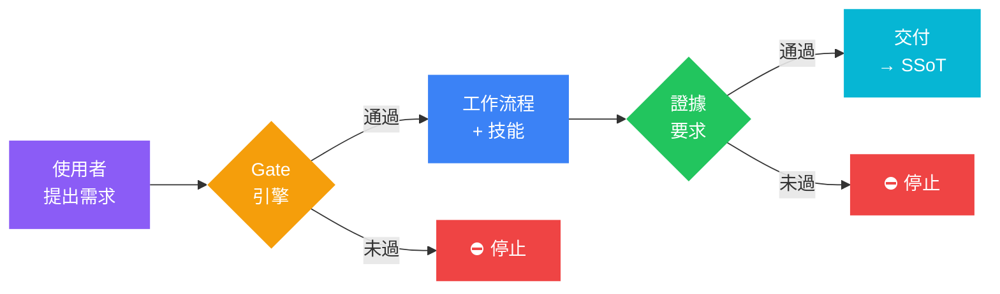
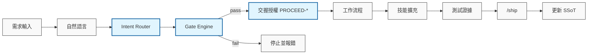

# Agentic OS v1.4.1 (Runtime v1.1 Anti-Drift Edition)

[English Version](../README.md)

> 一套給 AI coding agent 的治理框架：用工作流程、交付閘門與工程護欄，讓 agent 的行為可預期、可驗證。

## 專案定位

**Agentic OS** 是一套可攜的治理框架，適用於 Gemini、Claude、GPT 等主流模型。它讓 AI agent 在理解代碼庫、遵守工程護欄的同時，以較低的 token 成本穩定執行複雜任務。

我們對齊並優化了 Google Antigravity / Codex Web / Codex App 的使用情境：

- **Self-Managed**：AI 自行分類任務並套用對應的治理閘門。
- **Anti-Drift Engine**：強制防跳步驟的 `Gate` 與交握機制，防止 AI 略過流程或宣稱未經驗證的完成。
- **Concurrency & Migration Safe**：衝突感知的多 session 保護、多人協作的 metadata 防衝突，以及既有專案無痛導入的 `/audit` 工作流。
- **Token Optimized**：針對不同風險等級自動調整治理強度，`tiny-fix` 走 fast-path 以節省成本。
- **Command-first**：用標準化指令觸發 Agent 能力，確保行為一致性。
- **10 不可違反原則**：[設計哲學](../.agentcortex/docs/AGENT_PHILOSOPHY_zh-TW.md)定義 P1-P10 核心信條 — AI 主導、不跳步驟、憲法高於任務、無證據不完成、跨模型合規。
- **命名空間隔離**：下游專案可自由添加自定義 skill 和 workflow，框架用 `.agentcortex-manifest` 區分管理範圍，用戶指令永遠優先。
- **14 項專業技能**：每個 skill metadata 都宣告在哪個 phase 自動啟用，AI 不需要人類提示就知道何時使用。

## 運作原理

每個階段的核心信條都一樣：沒有可驗證的證據，任務就不算完成 —— 而 Gate 會強制執行這件事，而不是信任 AI 自行誠實回報。



## 三條起點路徑

依你的專案狀態挑一條（詳細開場提示見「快速開始 §3」）：

| 起點 | 第一個指令 | 完整鏈 |
|---|---|---|
| 🆕 全新專案 + 多 feature 想法 | `/spec-intake` | spec-intake → 選 feature → bootstrap → app-init → plan → implement |
| 🏗️ 既有 repo 首次導入 | `/audit`（唯讀掃描，零風險） | audit → app-init → spec-intake → quick-win → feature |
| 🎯 單一明確任務 | `/bootstrap` | bootstrap → plan → implement → review → test → ship |

詳見 [生命週期基準測試](LIFECYCLE_BENCHMARK_zh-TW.md)（[English](LIFECYCLE_BENCHMARK.md)）— 6 個真實場景的 token 消耗數據。

## 參考來源

- Superpowers 專案（理念參考）：<https://github.com/obra/superpowers>
- 專案導入範例：`.agentcortex/docs/PROJECT_EXAMPLES_zh-TW.md`
- 遷移與整合指南：`.agentcortex/docs/guides/migration_zh-TW.md`
- Token 治理指南：`.agentcortex/docs/guides/token-governance_zh-TW.md`
- Token 優化快速指南：[token-optimization-quickstart_zh-TW.md](guides/token-optimization-quickstart_zh-TW.md)（[English](guides/token-optimization-quickstart.md)）
- 生命週期基準測試：[LIFECYCLE_BENCHMARK_zh-TW.md](LIFECYCLE_BENCHMARK_zh-TW.md)

## 目錄總覽

- `.agent/rules/engineering_guardrails.md`：工程憲法（含分類規則與 Gate 標準）
- `.agent/workflows/*.md`：單檔工作流程（bootstrap, plan, implement, handoff, ship 等）
- `.agent/skills/<skill>/SKILL.md`：技能檔（Codex 相容路徑：`.agents/skills`）
- `.agentcortex/context/current_state.md`：全域唯讀狀態（SSoT）
- `.agentcortex/context/work/`：任務隔離 Work Log
- `docs/adr/`：架構決策記錄
- `.agentcortex/docs/CODEX_PLATFORM_GUIDE_zh-TW.md`：Codex 平台指南
- `AGENTS.md`：跨平台長期指令入口

## 系列功能對照 (Superpowers Based)

| 功能 | 指令 | 對應檔案 | 目的 |
| :--- | :--- | :--- | :--- |
| 任務啟動 | `/bootstrap` | `.agent/workflows/bootstrap.md` | 固定目標、限制與 AC，凍結分類 |
| 頭腦風暴 | `/brainstorm` | `.agent/workflows/brainstorm.md` | 快速發散方案並收斂 |
| 探索研究 | `/research` | `.agent/workflows/research.md` | 補齊未知與限制 |
| 規格定義 | `/spec` | `.agent/workflows/spec.md` | 產出可驗收規格 |
| 任務規劃 | `/plan` | `.agent/workflows/plan.md` | 先規劃再動手 |
| 實作執行 | `/implement` | `.agent/workflows/implement.md` | 安全實作、可回退 |
| 代碼審查 | `/review` | `.agent/workflows/review.md` | 風險與品質檢查 |
| 回顧精進 | `/retro` | `.agent/workflows/retro.md` | 形成可複用經驗 |
| 交接摘要 | `/handoff` | `.agent/workflows/handoff.md` | 跨回合核心：保留決策脈絡 |
| 決策記錄 | `/decide` | `.agent/workflows/decide.md` | 記錄關鍵決策與推理，防止跨回合重複推導 |
| 測試分類 | `/test-classify` | `.agent/workflows/test-classify.md` | 依任務分類自動選擇測試深度與證據格式 |
| 最終交付 | `/ship` | `.agent/workflows/ship.md` | 彙整提交證據與歸檔狀態 |
| 規格匯入 | `/spec-intake` | `.agent/workflows/spec-intake.md` | 匯入並拆解多功能外部規格 |
| 架構決策 | `/adr` | `.agent/workflows/adr.md` | 建立架構決策記錄 |
| 外部委派 (自然語言) | `ask-openrouter` | `.agent/workflows/ask-openrouter.md` | [可選] 將任務委派給 OpenRouter 模型 |
| Codex CLI 執行 | `codex-cli` | `.agent/workflows/codex-cli.md` | [可選] 透過 Codex CLI 安全執行任務 |

## Antigravity / Codex 路徑差異

- Antigravity 主要讀取：`.agent/skills` (Native Agent 核心能力)
- Codex 主要掃描：`.agents/skills` (Codex App 專屬能力)
- **注意**：兩者目錄獨立存在以適應不同平台配置。若需共用，請根據需求手動鏡像或建立軟連結。

## 規則檔與安全邊界

- `.antigravity/rules.md`：Antigravity 優先讀取的規則總表。
- `codex/rules/default.rules`：Codex 規則擴充入口。
- `AGENTS.md`：跨平台長期指令，引用 `engineering_guardrails.md`。

### 執行守門員 (Anti-Drift Engine)

這套機制防止 AI 繞過授權與工作流程，確保每一次操作都具備證據與手動確認。



### 高風險指令安全設定

以下命令預設禁止直接執行，需先提出風險與回退方案：

- `rm -rf`、`git reset --hard`、`git clean -fdx`
- `docker system prune -a`、`chown -R`、`curl ... | bash`、`chmod -R 777`

## 快速開始

### 1) 部署到專案

**先決條件**：

| 依賴 | 必要？ | 用途 |
|:---|:---|:---|
| **Git** | 必要 | 版本控制與部署 |
| **Bash** | 必要 | 執行部署與驗證腳本（[Git for Windows](https://gitforwindows.org/) 已內建） |
| **Python 3.9+** | 推薦 | 啟用完整驗證（metadata、編碼、命令同步檢查） |

> **沒有 Python？** 框架可以正常部署與使用。驗證會以降級模式執行 — Python 相關檢查報告 `WARN` 而非 `FAIL`。
> 使用 `--no-python` 抑制警告：`bash .agentcortex/bin/validate.sh --no-python`

```bash
./installers/deploy_brain.sh /path/to/your-project
```

> [!TIP]
> 部署腳本會自動將 Agent 相關暫存檔（如 `work/`, `skills/` 等）加入 `.gitignore`，防止其被上傳到遠端倉庫。

### 1a) 客製化而不衝突（Fork 或 Clone）

無論你用 **fork**（再 `git pull upstream`）或 **clone + `deploy_brain.sh`** 導入，同一條規則讓升級無痛：**只「加」你自己的檔，絕不原地編輯框架檔。** 把客製放在框架保證永不觸碰的地方，它就能同時撐過 `git pull upstream`（fork）與下次 `deploy`（clone）：

| 你想要… | 放這裡 | 為何升級不會壞 |
|---|---|---|
| 加專案治理（narrow/停用某指令） | `AGENTS.override.md`（專案根）或 `~/.agentcortex/AGENTS.override.md`（個人） | session 起始 present-only 載入；框架永不 ship 這些檔。MAY narrow/disable，但**不得**放寬 delivery gates。 |
| 加你自己的 skill | `.agents/skills/custom-<name>/SKILL.md`（+ `.agent/skills/custom-<name>` metadata） | `custom-*` 是框架永不 ship 的保留 namespace → 零碰撞、不被覆寫。 |
| 調整 skill 啟用（pin/排除） | `.agentcortex/context/private/user-preferences.yaml` | gitignored、個人、bootstrap 載入。 |

**不要做的事**：原地編輯框架檔（`AGENTS.md`、`.agent/rules/*`、`.agent/workflows/*`、已 ship 的 skill body）會在 `git pull upstream`（fork）造成 merge 衝突、在下次 `deploy`（clone）被強制更新。框架 **skill** 是唯一寬容的例外——你若改了，`deploy` 會把你的版本保留成可見的 `<file>.acx-incoming` sidecar，而非靜默覆寫——但更乾淨的做法永遠是複製成 `custom-<name>` skill 再改。治理、安全、workflow 檔一律強制更新，確保你持續收到修補。

### 2) Codex / Antigravity 開場

```text
Fetch and follow instructions from <your-raw-url>/.codex/INSTALL.md
```

> 若遇到 403 錯誤，請直接貼上 `.codex/INSTALL.md` 全文。

### 3) 開場提示 — 依你的起點挑一條

> **共通前綴**（任何情境都先貼這一段）
>
> ```text
> 請先閱讀並遵循 AGENTS.md — 這是本專案的治理憲法。
> 在 /review 與 /test 通過前，禁止宣稱完成。
> ```

#### 情境 A：全新專案 + 多 feature 想法

> 適用：有產品想法、有多個功能、還沒寫 code。

```text
這是一個全新的專案。我的初步想法是：
[一兩段描述產品和功能]

請先執行 /spec-intake，把它拆成 Feature Inventory。
我選定第一個 feature 後，再跑 /bootstrap → /app-init 建立技術棧 ADR，
然後 /plan → /implement。
```

**為何 /spec-intake 先行**：多 feature 的 raw idea 必須先拆成 `docs/specs/_product-backlog.md`，
否則 /bootstrap 的分類和 Work Log scope 都會錯位。

#### 情境 B：既有 repo 首次導入 Agentic OS

> 適用：repo 已經有程式碼，剛部署完框架。

```text
這個 repo 已有程式碼，剛部署完 Agentic OS。
請先跑 /audit（唯讀掃描）建立既有結構的地圖，
然後 /app-init 紀錄技術棧 ADR，
等我準備加功能時再跑 /spec-intake。
```

#### 情境 C：已穩定專案 + 單一明確任務

> 適用：專案已有 ADR，目前只想做一件具體的事。

```text
請先執行 /bootstrap 分類此任務。
需求：[一句話]
目標檔案：[path1, path2]
限制：[不可改 API / 不可改 schema]
驗收：[列 2-3 點]
```

#### 情境 D：帶入前期討論素材（已與其他 AI 討論過）

> 適用：手上有別的 AI 寫好的規格、白皮書、技術文件。直接貼入即可，AI 會自行提取與歸檔。

```text
請先執行 /spec-intake — 我帶來了前期討論的完整素材，請先消化後再決定流程。
---
[直接貼上所有素材：對話記錄、規格書、技術文件等]
---
```

> AI 在 /spec-intake 期間會自動：寫入 `docs/specs/_raw-intake.md` → 拆 Feature Inventory →
> 寫入 `docs/specs/_product-backlog.md`。完成後再走 /bootstrap → /app-init 鏈。

### 4) 跨回合交接提示（續做任務時使用）

```text
以下是前一個模型留下的 handoff，請以此為「唯一真實狀態」繼續工作。
你不得重新設計、不得調整 scope，只能依此 handoff 完成你的任務。
[貼上 handoff 內容]
```

### 5) 用指令驅動開發

1. `/bootstrap`：初始化任務並凍結分類
2. `/plan`（或 `/write-plan`）：列檔案、步驟、風險、回退
3. `/implement`（或 `/execute-plan`）：只改已同意範圍
4. `/review`：做嚴格自審
5. `/test`：列並執行最小必要驗證
6. `/handoff`：跨回合交接（非 tiny-fix 必須）
7. `/ship`：整理 commit / 變更摘要 / 測試結果

## 建議節奏


- **小修補（tiny-fix）**：`classify → plan (inline) → execute`，附最小證據
- **快速修補（quick-win）**：`bootstrap → check Spec Index → plan → implement → evidence → ship`
- **功能開發（feature）**：`/bootstrap → /spec → /plan → /implement → /review → /test → /handoff → /ship`
- **架構調整（architecture-change）**：`/bootstrap → /adr → /spec → /plan → /implement → /review → /test → /handoff → /ship`
- **緊急修復（hotfix）**：`/bootstrap → /research → /plan → /implement → /review → /test → /ship`

## Token Hygiene（避免小任務放大成本）

- 任務啟動只讀：`.agentcortex/context/current_state.md` 與 `.agentcortex/context/work/<worklog-key>.md`（worklog-key = branch name 的 filesystem-safe 正規化，例如 `/` 換 `-`）。
- 優先精準檢索（`rg <keyword> <path>`），避免全樹掃描。
- 先用 `/plan` 收斂檔案範圍，再進入 `/implement`，降低來回修正。
- 小型任務沿用 Fast Lane；若變更開始影響狀態/策略，立即升級流程，避免返工。

## 文件導覽

| 目標 | 先讀這裡 | 用途 |
|:---|:---|:---|
| 安裝或升級 Agentic OS | [快速開始](#快速開始)、[遷移與整合指南](../.agentcortex/docs/guides/migration_zh-TW.md) | 部署指令、更新流程、既有專案導入 |
| 選擇合適模型 | [模型選擇指南](AGENT_MODEL_GUIDE_zh-TW.md)、[生命週期基準測試](LIFECYCLE_BENCHMARK_zh-TW.md) | 模型取捨與實測 token 成本 |
| 跑穩定的 agent 工作流 | [設計哲學](../.agentcortex/docs/AGENT_PHILOSOPHY_zh-TW.md)、[測試協議](../.agentcortex/docs/TESTING_PROTOCOL_zh-TW.md) | 核心規則、證據要求、驗證標準 |
| 使用特定平台 | [Codex 平台指南](../.agentcortex/docs/CODEX_PLATFORM_GUIDE_zh-TW.md)、[Antigravity v5 Runtime](../.agentcortex/docs/guides/antigravity-v5-runtime.md) | 平台載入、交接、相容性注意事項 |
| 理解治理內部機制 | [文件治理](../.agentcortex/docs/guides/doc-governance.md)、[非線性情境](../.agentcortex/docs/NONLINEAR_SCENARIOS_zh-TW.md) | 狀態、交接、復原與文件生命週期 |
| 安全擴充技能 | [Skill Ecosystem](architecture/skill-ecosystem.md)、[Token 治理指南](../.agentcortex/docs/guides/token-governance_zh-TW.md) | skill 封裝、觸發策略、context 預算控制 |

## 自我驗證

```bash
.agentcortex/bin/validate.sh
```

完整平台建議請見 `.agentcortex/docs/CODEX_PLATFORM_GUIDE_zh-TW.md`。

---
詳細變更請見 [CHANGELOG.md](../CHANGELOG.md)

## Windows（無 bash）部署補充

若你的 Windows 環境沒有 `bash`，可使用 `installers/` 目錄的 wrapper：

- PowerShell：`powershell -ExecutionPolicy Bypass -File .\installers\deploy_brain.ps1 .`
- CMD：`installers\deploy_brain.cmd .`

這兩個 wrapper 會轉呼叫 `deploy_brain.sh`，因此仍需要安裝 [Git for Windows](https://gitforwindows.org/)（已內含 Git Bash）或 WSL。
