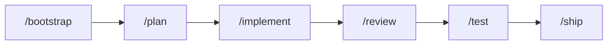

# Reference

The full feature, workflow, skill, command, and architecture detail. The
[README](../README.md) keeps only the pitch; this is the lookup.

## Gate engine & phase system

Every task runs through mandatory phases, recorded as gate receipts in the work log; the local pre-commit validator flags a skipped phase before it lands.



| Classification | Required Phases |
|:---|:---|
| **tiny-fix** | Classify → Execute → Evidence → Done |
| **quick-win** | Bootstrap → Plan → Implement → Evidence → Ship |
| **feature** | Bootstrap → Spec → Plan → Implement → Review → Test → Handoff → Ship |
| **hotfix** | Bootstrap → Research → Plan → Implement → Review → Test → Ship |
| **architecture-change** | Bootstrap → ADR → Spec → Plan → Implement → Review → Test → Handoff → Ship |

## Engineering guardrails

A constitution for AI behavior — safety invariants always loaded (`AGENTS.md`); deeper rules load by task tier and phase:

- **No Evidence = No Completion** — narrative claims are not proof
- **Scope Discipline** — unauthorized refactoring is strictly prohibited
- **Destructive Command Gate** — `rm -rf`, `git reset --hard`, force pushes & co. are deny-by-default: blast radius + rollback plan covering untracked state + user confirmation first (canonical rule and full command list: `AGENTS.md §Core Directives`)
- **OWASP Top 10 Auto-Scan** — security checks run during `/implement` and `/review`
- **Confidence Gate** — AI must declare confidence at plan/implement; low confidence triggers escalation

## Built-in skills

Skills auto-activate based on task classification and workflow phase:

| Skill | Trigger | Description |
|:---|:---|:---|
| Test-Driven Development | feature, architecture-change | Red → Green → Refactor cycles |
| Systematic Debugging | bug encounter | 4-phase root cause analysis |
| Red Team / Adversarial | review, test | Classification-based security analysis |
| API Design | API endpoints detected | Endpoint validation enforcement |
| Auth Security | auth code detected | Hashing, tokens, rate limiting |
| Database Design | migration detected | Forward-only ORM-aware migration safety |
| Frontend Patterns | UI components | Component and state management patterns |
| Parallel Agent Dispatching | complex tasks | Coordinated subagent execution |
| Subagent-Driven Development | multi-module tasks | Multi-agent coordination |
| Karpathy Principles | all coding tasks | Behavioral guardrails against common LLM coding mistakes |
| Production Readiness | feature, architecture-change | Pre-ship observability: error sinks, log strategy, rollback telemetry |
| Verification Before Completion | /ship | 5-gate check: Scope → Quality → Evidence → Risk → Communication |
| Git Worktrees | parallel branches | Worktree isolation workflows |
| Doc Lookup | documentation needed | Documentation retrieval strategy |

## Commands

| Command | Purpose |
|:---|:---|
| `/bootstrap` | Initialize task, classify scope, create work log |
| `/spec-intake` | Import and decompose external specs |
| `/spec` | Define verifiable specifications |
| `/plan` | Create implementation plan with rollback steps |
| `/implement` | Execute code changes (gate-protected) |
| `/review` | Logic, security, and scope audit |
| `/test` | Verify with minimal necessary tests |
| `/handoff` | Resumable state summary for next session |
| `/ship` | Consolidate evidence, update SSoT, merge |
| `/adr` | Architecture Decision Record |
| `/brainstorm` | Rapid solution exploration |
| `/research` | Autonomous research and recommendation |
| `/audit` | Read-only system mapping |
| `/retro` | Retrospective analysis |
| `/decide` | Record key decisions with reasoning |
| `/hotfix` | Emergency fix escalation |

## Single source of truth (SSoT)

Every project has one canonical state file. AI agents read it first, write to it last.

```
.agentcortex/context/
├── current_state.md          # Global project state (SSoT)
└── work/
    └── <branch-name>.md      # Per-task work log (isolated)
```

- **Work Logs** track per-task progress, evidence, and gate receipts
- **SSoT** tracks global decisions, lessons, and ship history
- **Handoff** enables seamless AI-to-AI continuity across conversations

## Multi-agent collaboration

Built for teams where multiple AI sessions work on the same codebase:

- **One Branch = One Owner** — prevents concurrent Work Log corruption
- **Single-Writer Locking** — atomic lock files block concurrent sessions per branch (configurable back to advisory)
- **Ship Guard** — checks for SSoT conflicts before merging
- **Session Identity** — every AI session writes its model name and timestamp

## Token efficiency

Designed for cost-effective models (Gemini Flash, Haiku, etc.):

- **Conditional Loading** — tiny-fix skips guardrails (~5,000 tokens saved)
- **Skill Cache Policy** — metadata-first loading, full SKILL.md only on cache miss
- **Phase Summary** — compact 1-liner per phase for low-token resume
- **Read-Once Discipline** — governance docs persist in context, never re-read

See the [Lifecycle Benchmark](https://github.com/KbWen/agentic-os/blob/main/docs/LIFECYCLE_BENCHMARK.md) ([繁體中文](https://github.com/KbWen/agentic-os/blob/main/docs/LIFECYCLE_BENCHMARK_zh-TW.md)) for real token consumption data across 6 development scenarios.

## Platform compatibility

| Platform | Status | Integration |
|:---|:---|:---|
| **Claude Code** | Native support | `CLAUDE.md` entrypoint + Claude platform guide |
| **OpenAI Codex** | Native support | `AGENTS.md`, Codex platform guide, and CLI delegation workflow |
| **Google Antigravity** | Native support | Intent router + Antigravity runtime guidance |
| **Cursor** | Compatible | Uses `AGENTS.md` / project-rule style guidance |
| **GitHub Copilot** | Compatible | Uses repository instructions and guardrail docs |
| **Any LLM Agent** | Compatible | Model-agnostic Markdown workflows and evidence rules |

## Architecture

```
your-project/
├── AGENTS.md                    # Global AI governance directives
├── CLAUDE.md                    # Claude Code integration entry
│
├── .agent/                      # Agent Intelligence Layer
│   ├── config.yaml              # Governance constants
│   ├── rules/                   # Engineering & security guardrails
│   ├── skills/                  # Skill metadata (auto-trigger defs)
│   └── workflows/               # Workflow definitions
│
├── .agents/skills/              # Full skill implementations
│   ├── test-driven-development/
│   ├── systematic-debugging/
│   └── ...
│
├── .agentcortex/                # Runtime & State Layer
│   ├── bin/                     # Deploy & validation scripts
│   ├── context/                 # SSoT + work logs
│   ├── docs/                    # Philosophy, platform guides, examples
│   ├── metadata/                # Skill registry & cache index
│   ├── templates/               # Reusable ADR/spec/README templates
│   └── tools/                   # Runtime tools (Python)
│
├── docs/                        # Project-level documentation
│   ├── specs/                   # Feature specifications
│   ├── adr/                     # Architecture Decision Records
│   └── architecture/            # Domain architecture docs
│
└── installers/                  # Cross-platform deploy wrappers
    ├── deploy_brain.sh          # Bash installer
    ├── deploy_brain.ps1         # PowerShell installer
    └── deploy_brain.cmd         # CMD installer
```

## Philosophy

Agentic OS is built on [10 non-negotiable principles](../.agentcortex/docs/AGENT_PHILOSOPHY.md): AI drives / human assists, never skip phases, constitution over task, no evidence = no completion, correctness first, token efficiency, cross-model compliance, actionable documentation, scope discipline, and explainability.
